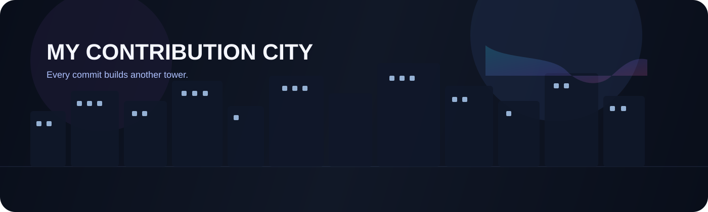

<!-- 🎬 HERO — custom visual intro -->

  

<!-- 👨‍💻 ABOUT / LIFE -->

  

<!-- ⚛️ TECH STACK -->

  

<!-- 🪪 DEVELOPER ID + DASHBOARD -->

  

## 🎌 Featured builds

| Project | What it is | Stack | Live |
|:---|:---|:---|:---:|
| [**NexGuard VPN Management**](https://nextguard.vercel.app/) | Full-stack VPN management platform with secure infrastructure and automation | `Next.js` `TypeScript` `Prisma` `PostgreSQL` `AWS` `WireGuard` | [Demo](https://nextguard.vercel.app/) |
| [**Foodio**](https://foodio-food.onrender.com/) | Food delivery platform with multi-role auth, tracking, and payments | `React` `Node.js` `Express` `MongoDB` `Redux` `Tailwind` | [Demo](https://foodio-food.onrender.com/) |
| [**Virtual Assistant**](https://virtualassistant-samk.onrender.com/) | AI-powered assistant with voice, chat, and image upload features | `React` `MongoDB` `Gemini API` `Cloudinary` `Web Speech API` | [Demo](https://virtualassistant-samk.onrender.com/) |
| [**Portfolio Website**](https://surajitportfolio.vercel.app/) | Personal portfolio and showcase for projects and skills | `Next.js` `React` `Tailwind` `Vercel` | [Portfolio](https://surajitportfolio.vercel.app/) |

 

## 🌃 My contribution city

*Every commit builds another tower — rebuilt automatically every day.*

  

<!-- 💌 LET'S CONNECT -->

  

 

**Always learning, always building.** 💜

